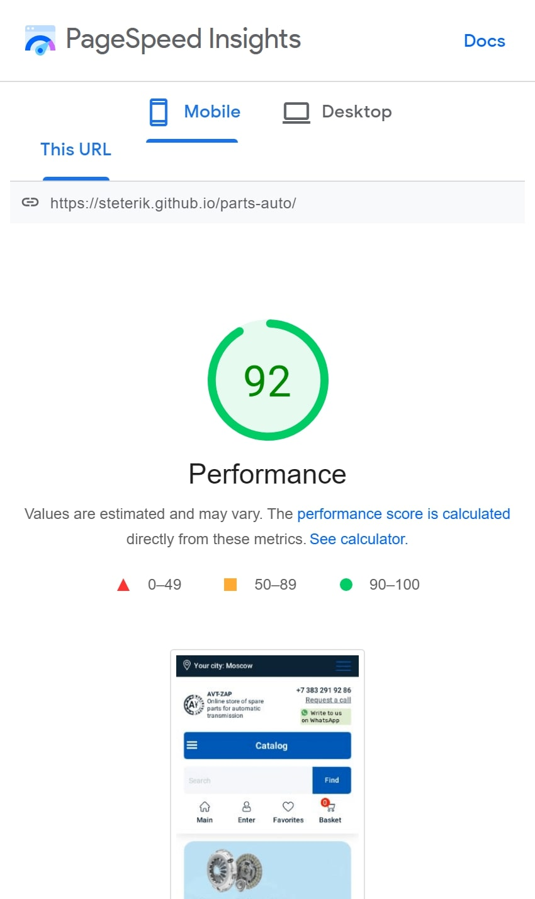

# This is the homepage of the online store
[Link to page⬅️][link]
## I used here:
* HTML (BEM, PUG)
* CSS (SASS)
* Pure JavaScript:
	* Cart. You can click on the "Buy" button and add the item to cart
	* Swiper-slider
	* Modal window on the "Request a call" button and in the "Your city" section
	* Tabs
	* Menu-burger
	* Anchor
* GULP
* NPM
* GIT

[Link to page⬅️][link]

### Mobile Optimization

[link]: https://steterik.github.io/parts-auto
